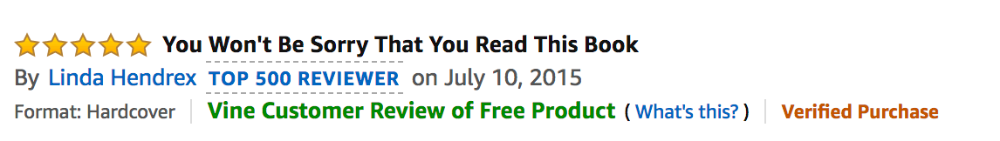

# Big Data Homework - "Alexa, can you handle big data?"

## Background

In this assignment you will put your ETL skills to the test. Many of Amazon's shoppers depend on product reviews to make a purchase. Amazon makes these datasets publicly available. However, they are quite large and can exceed the capacity of local machines to handle. One dataset alone contains over 1.5 million rows; with over 40 datasets, this can be quite taxing on the average local computer. Your first goal for this assignment will be to perform the ETL process completely in the cloud and upload a DataFrame to an RDS instance. The second goal will be to use PySpark or SQL to perform a statistical analysis of selected data.

There are two levels to this homework assignment. The second level is optional but highly recommended.

1. Create DataFrames to match production-ready tables from two big Amazon customer review datasets.
2. Analyze whether reviews from Amazon's Vine program are trustworthy.

- - -

## Summary

### Level 1

* Two datasets, [personal care appliances](https://s3.amazonaws.com/amazon-reviews-pds/tsv/amazon_reviews_us_Personal_Care_Appliances_v1_00.tsv.gz) and [mobile electronics](https://s3.amazonaws.com/amazon-reviews-pds/tsv/amazon_reviews_us_Mobile_Electronics_v1_00.tsv.gz) are selected.

* Two notebooks are used to perform the PySpark ETL processes. One need to be run after the other one's ETL process finished.

* The numbers of valid records of personal care appliances and mobile electronis are 85978 and 104973.

### Level 2 (Optional)

In Amazon's Vine program, reviewers receive free products in exchange for reviews.

  

Amazon has several policies to reduce the bias of its Vine reviews: [https://www.amazon.com/gp/vine/help?ie=UTF8](https://www.amazon.com/gp/vine/help?ie=UTF8).

Are Vine reviews truly trustworthy? 

* If you choose to use SQL, first use Spark in Google Colab to extract and transform the data and load it into a SQL table on your RDS account. Perform your analysis with SQL queries on RDS.

* There are 190951 reviews have been made. 190901 from non-Vine reviewers and 50 from Vine reviewers.

* There are 101150 5-star reviews have been made. 101120 from non-Vine reviewers and 30 from Vine reviewers.

* Vine reviewers tend to give higher rating. The average rating by all reviews is 3.86. The average rating by non-Vine reviewers is 3.86 and the average rating by Vine reviewers is 4.32.

* Reviews made by Vine reviewers is more trustful. Vine reviews got 1219 votes with an upvote rate at 85% and non-Vine reviews got 417394 with an upvote rate at 81%.

* The top active reviewers are mostly non-Vine reviewers. The upvote rates of the top 5 reviewers are higher than 90%.

In conclusion, vine reviews are trustworthy. However, the vine reviewers are not very active. Active reviewers with higher upvote rate should be recruited by the vine program.

- - -

## Resources

[customer review datasets](https://s3.amazonaws.com/amazon-reviews-pds/tsv/index.txt)

- - -

### Copyright

© 2021 Trilogy Education Services, LLC, a 2U, Inc. brand. Confidential and Proprietary. All Rights Reserved.
